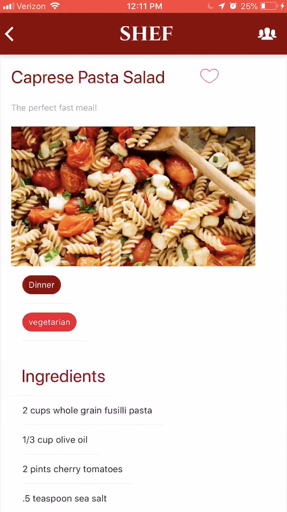
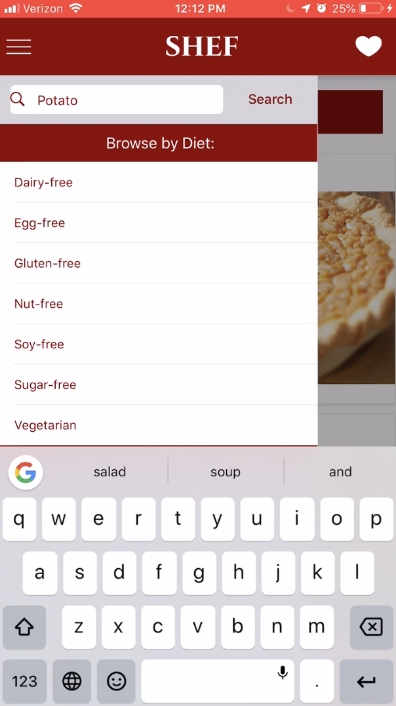
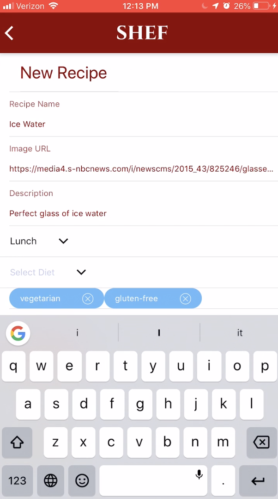
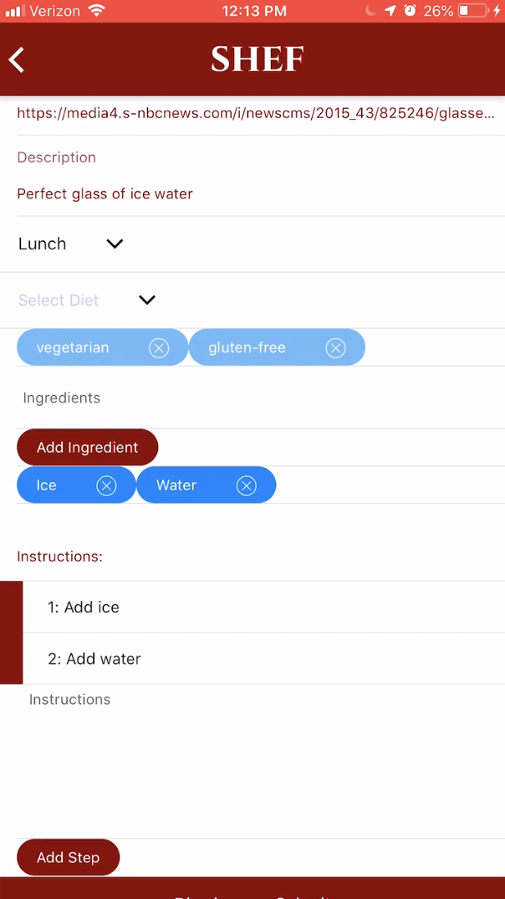
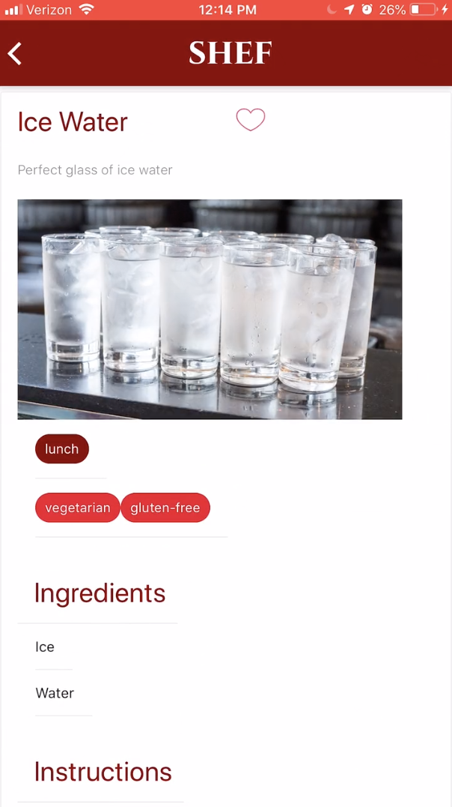

# Shef #

* Shef is a recipe storage application that utilizes version control to keep track of variations in recipe components for each particular dish

* Shef allows users to browse through recipes by searching or filtering based on a number of categories

* Once a user signs-up and is logged in are more components become accessible

* These include being able to create original recipes as well create new versions of existing recipes

* When the users view a recipe they can scroll through the versions and upon clicking on a particulatr version view the ingredients, cooking instructions and dietary resctrictions


# Demo 12/19/2018

## Demo Video Link: https://vimeo.com/309322890


## single recipe view



## browse by category or keyword



## adding new recipes




## new recipe view



## Installing

```
git clone https://github.com/e-scheetz/Shef
cd Shef
npm install
```

## Built With

* Javascript, HTML, CSS
* React-Native
* Materialize, Native Base
* Backend: https://github.com/e-scheetz/Shef-backend

## Authors

* [Russell Storms](https://github.com/rstorms90)
* [Erik Scheetz](https://github.com/e-scheetz)
* [Riley Burns](https://github.com/rileyburns345)
